==================================================
# RESUMO DOS DADOS COLETADOS
==================================================

## RQ 01. Sistemas populares são maduros/antigos?

### Métrica: idade do repositório

**Para todos os repositórios:**
  Mediana: 3056 dias
  Mín: 63 dias, Máx: 6344 dias
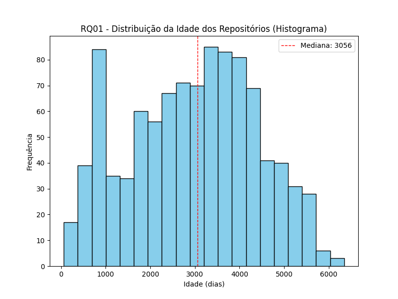

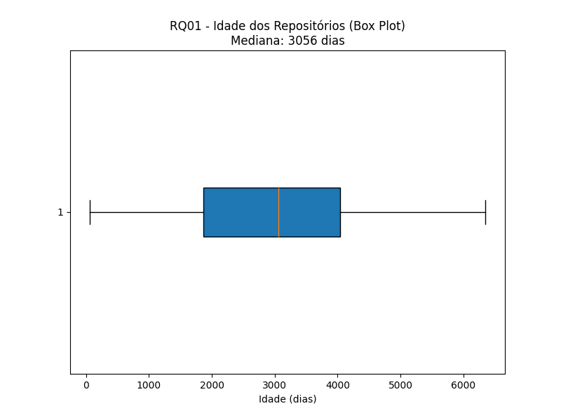

**Para top10 repositórios:**
  Mediana: 3443 dias
  Mín: 2343 dias, Máx: 4335 dias
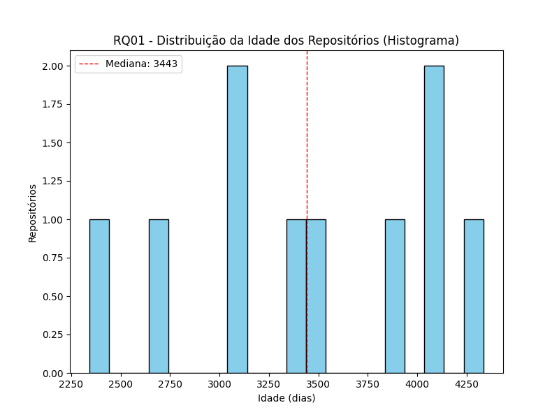

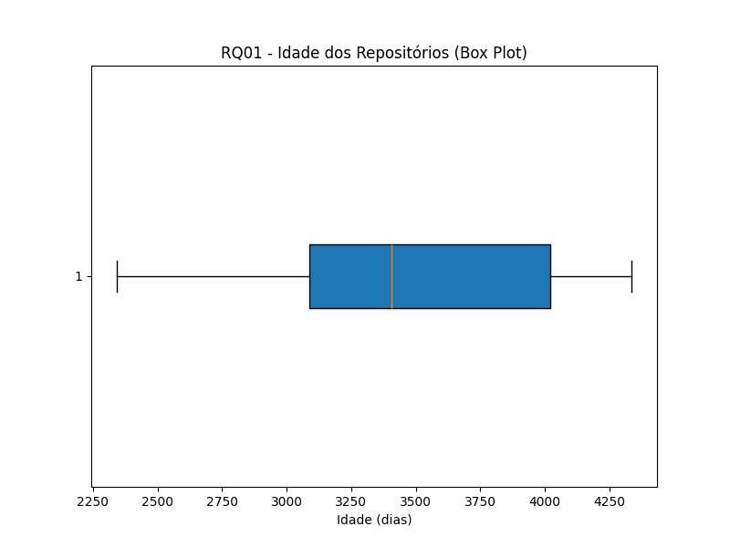

**Comparativo:**

## RQ 02. Sistemas populares recebem muita contribuição externa?

### Métrica: Pull Requests Aceitas

**Para todos os repositórios:**
  Mediana: 710
  Mín: 0, Máx: 86225
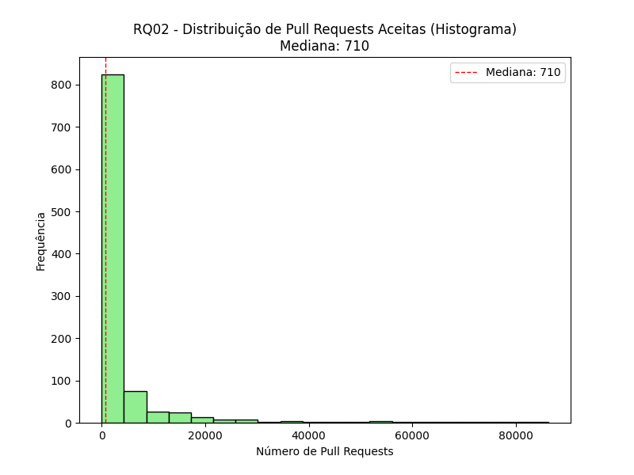

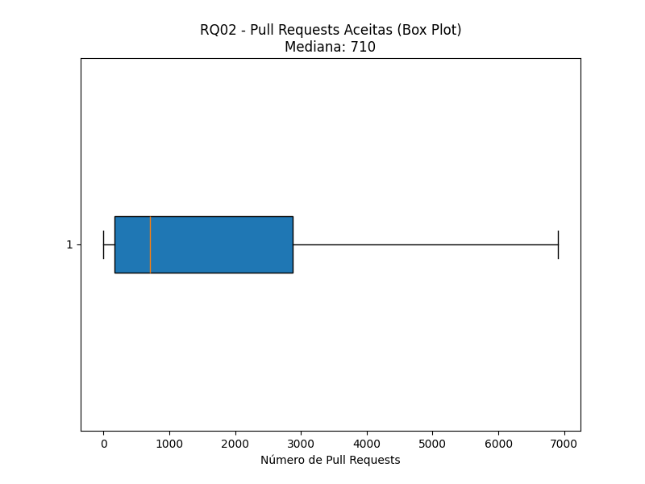

**Para top10 repositórios:**
  Mediana: 1071
  Mín: 142, Máx: 25733
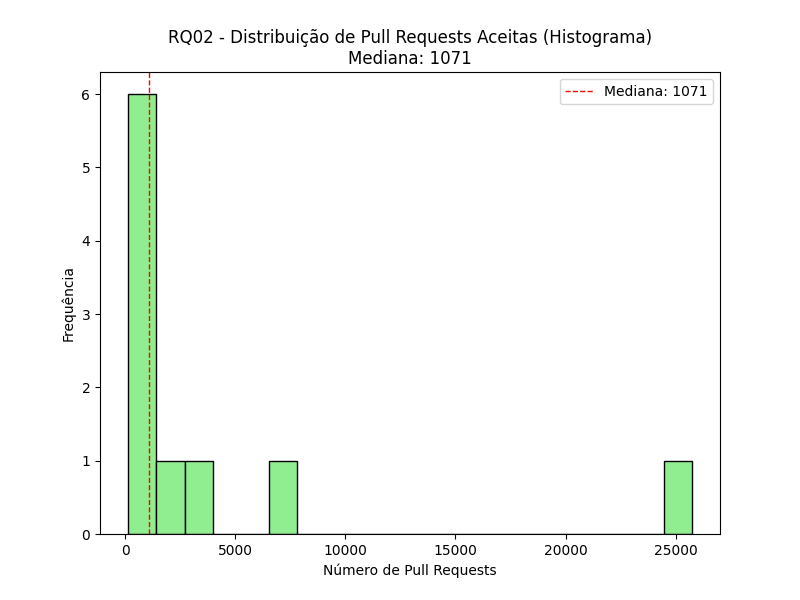

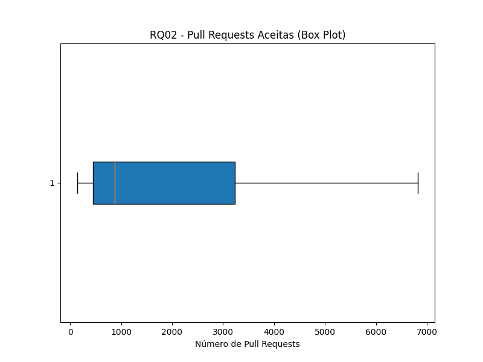

## RQ 03. Sistemas populares lançam releases com frequência? 

### Métrica: Releases

**Para todos os repositórios:**
  Mediana: 36
  Mín: 0, Máx: 1000
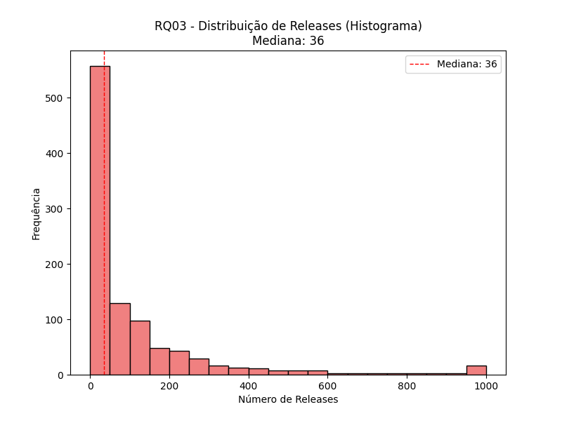

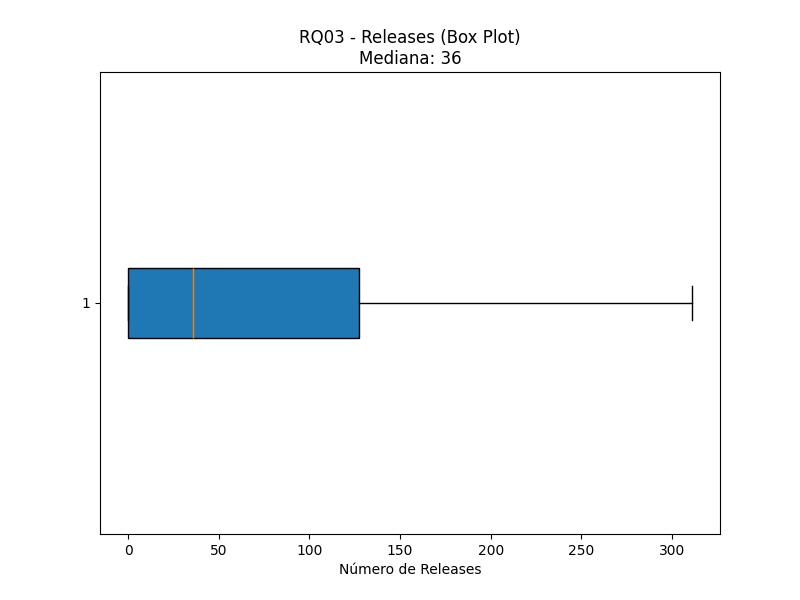

**Para top10 repositórios:**
  Mediana: 0
  Mín: 0, Máx: 1
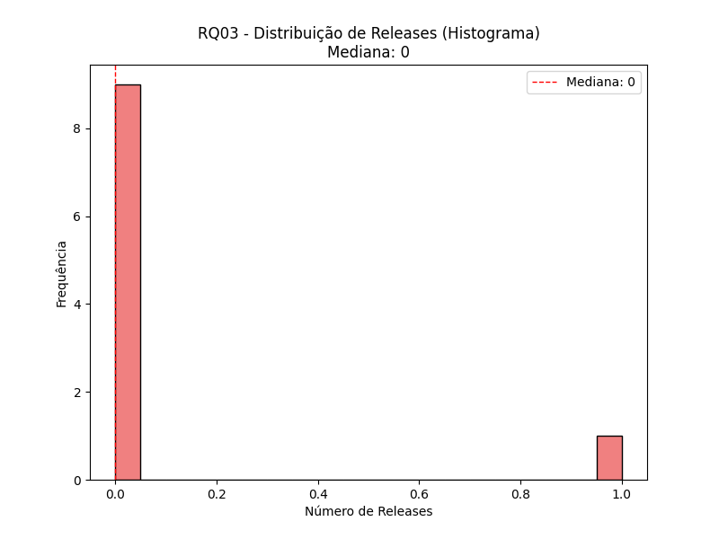

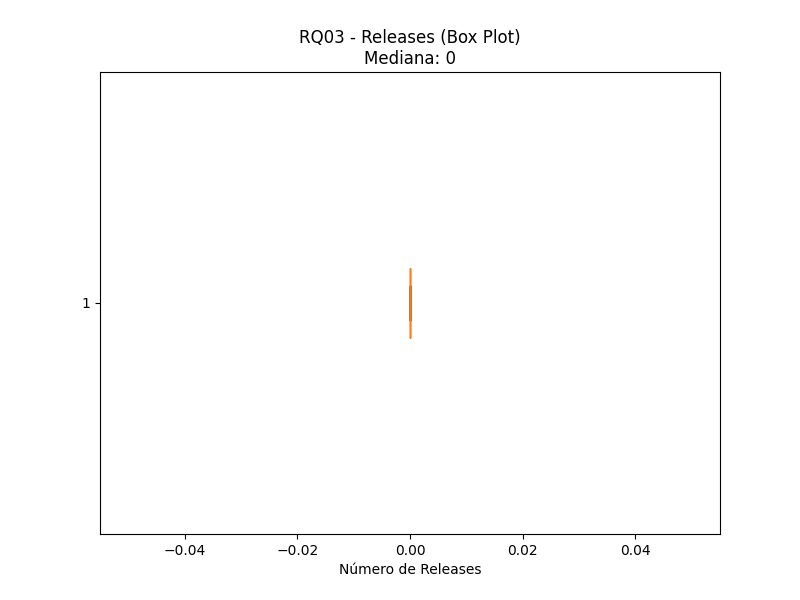

## RQ 04. Sistemas populares são atualizados com frequência

### Métrica: Dias desde a última atualização

**Para todos os repositórios:**
  Mediana: 0 dias
  Mín: 0 dias, Máx: 4 dias
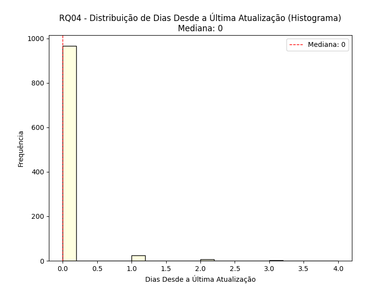

**Para top10 repositórios:**
  Mediana: 0 dias
  Mín: 0 dias, Máx: 0 dias
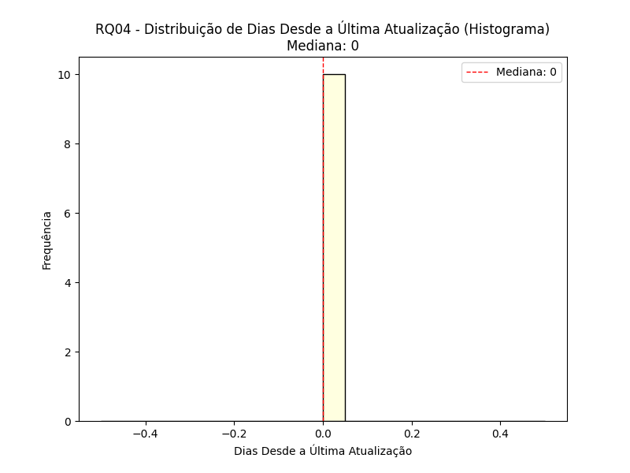

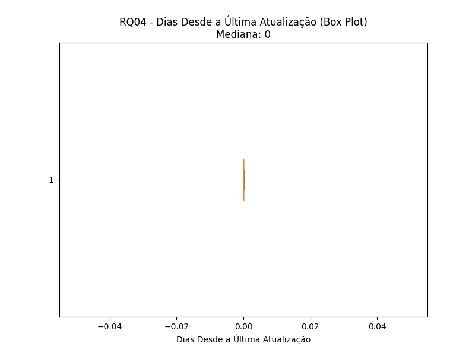

## RQ 05. Sistemas populares são escritos nas linguagens mais populares?

### Linguagem primária de cada um desses repositórios
  Python: 189 repositórios
  TypeScript: 156 repositórios
  JavaScript: 130 repositórios
  Unknown: 103 repositórios
  Go: 73 repositórios
  Java: 50 repositórios
  C++: 48 repositórios
  Rust: 44 repositórios
  C: 25 repositórios
  Jupyter Notebook: 22 repositórios
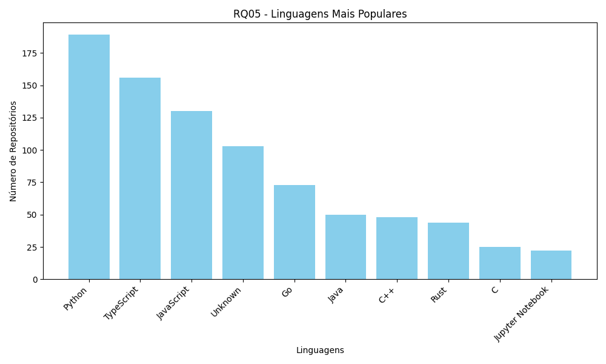

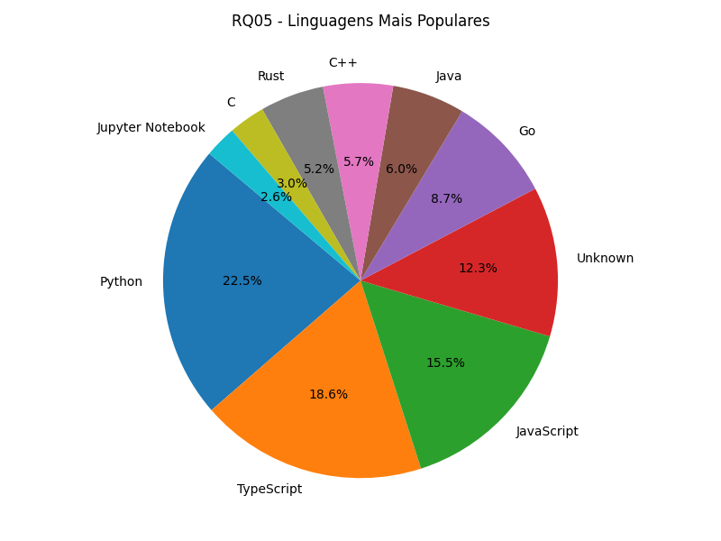

## RQ 06. Sistemas populares possuem um alto percentual de issues fechadas? 

### Razão entre número de issues fechadas pelo total de issues

**Para todos os repositórios:**
  Mediana: 86.57%
  Mín: 8.77%, Máx: 100.00%
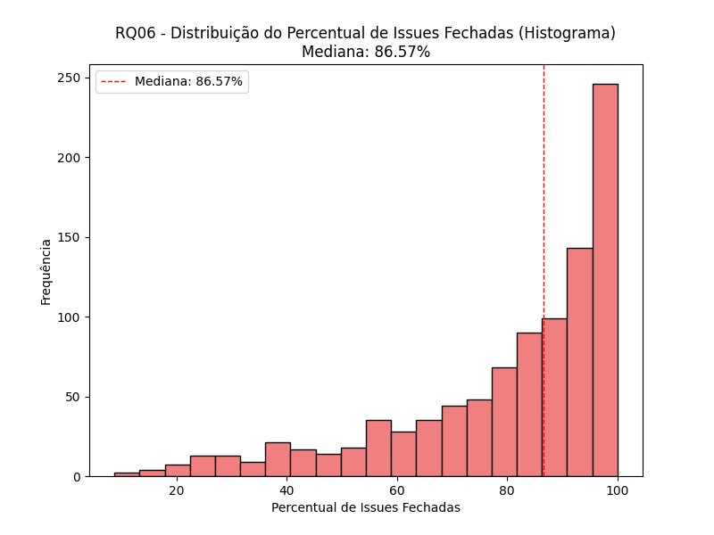

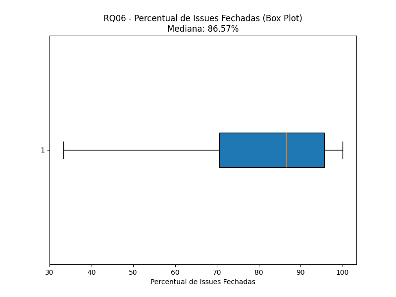

**Para top10 repositórios:**
  Mediana: 96.05%
  Mín: 26.69%, Máx: 99.02%
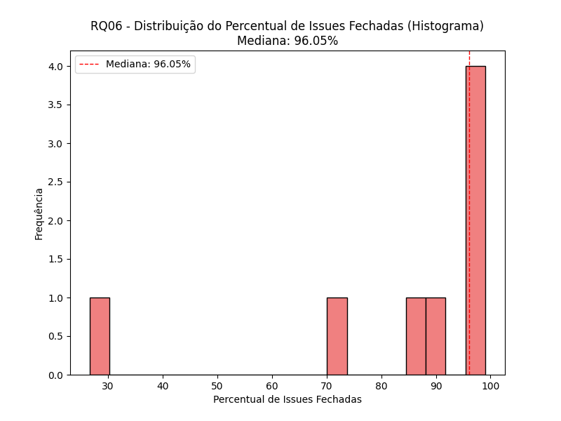

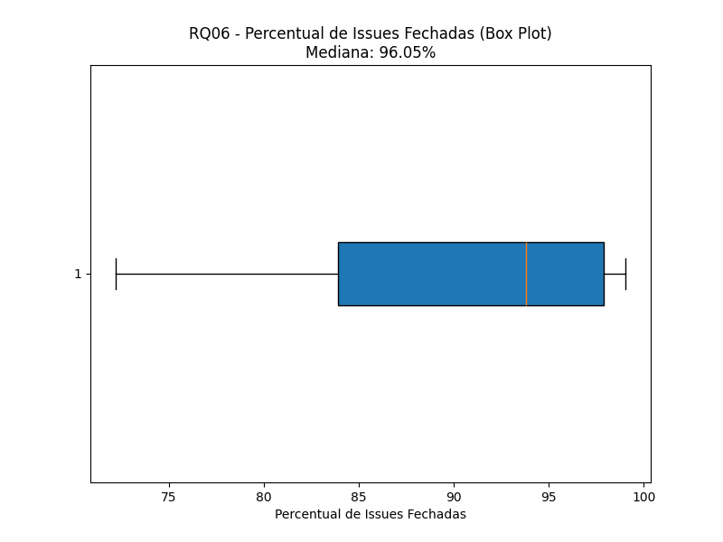

## RQ07 - ANÁLISE POR LINGUAGEM

### Sistemas escritos em linguagens mais populares recebem mais contribuição externa, lançam mais releases e são atualizados com mais frequência? 

Linguagens mais populares:
  - Python
  - TypeScript
  - JavaScript
  - Unknown
  - Go

Comparação: Linguagens Populares vs Outras
| Métrica                    | Populares   | Outras      |
| -------------------------- | ----------- | ----------- |
| Repositórios               |         651 |         349 |
| Mediana PRs Aceitas (RQ02) |         715 |         681 |
| Mediana Releases (RQ03)    |          42 |          31 |
| Mediana Dias Update (RQ04) |           0 |           0 |

Detalhamento por linguagem (Top 10):
| Linguagem   | Qty | Med PRs | Med Rels | Med Days Upd |
| ----------- | --- | ------- | -------- | ------------ |
| Python      | 189 |     548 |       23 |            0 |
| TypeScript  | 156 |    2143 |      147 |            0 |
| JavaScript  | 130 |     551 |       34 |            0 |
| Unknown     | 103 |     129 |        0 |            0 |
| Go          |  73 |    1690 |      124 |            0 |
| Java        |  50 |     713 |       44 |            0 |
| C++         |  48 |     934 |       60 |            0 |
| Rust        |  44 |    2174 |       87 |            0 |
| C           |  25 |     113 |       32 |            0 |
| Jupyter ... |  22 |     147 |        0 |            0 |

Conclusão
✓ Linguagens populares recebem MAIS contribuições externas
✓ Linguagens populares lançam MAIS releases
✗ Linguagens populares são atualizadas com MENOS frequência
