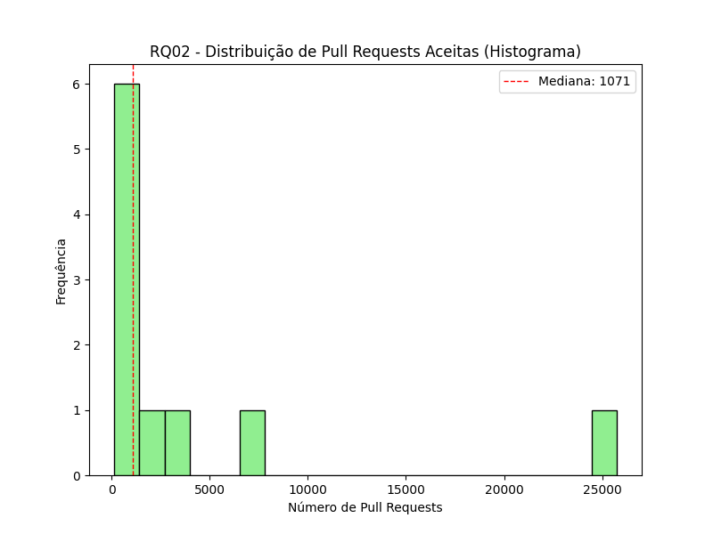
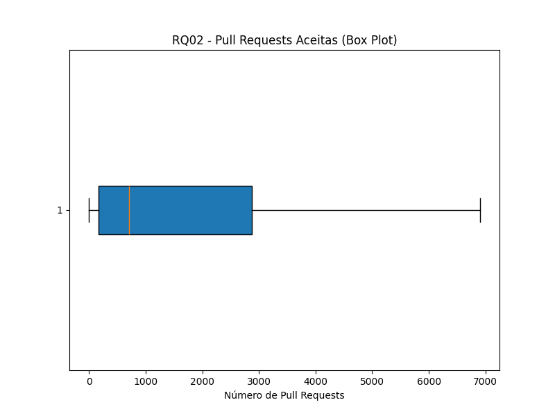
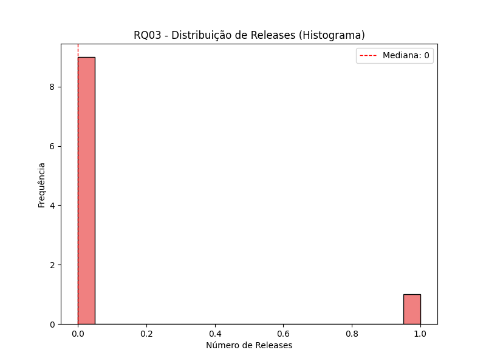
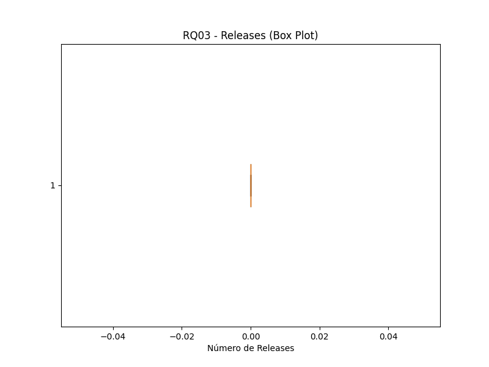
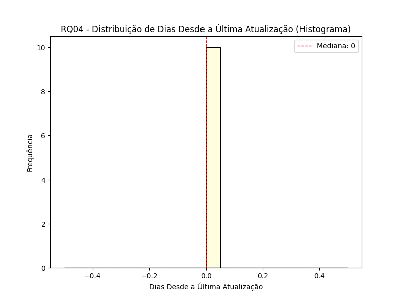
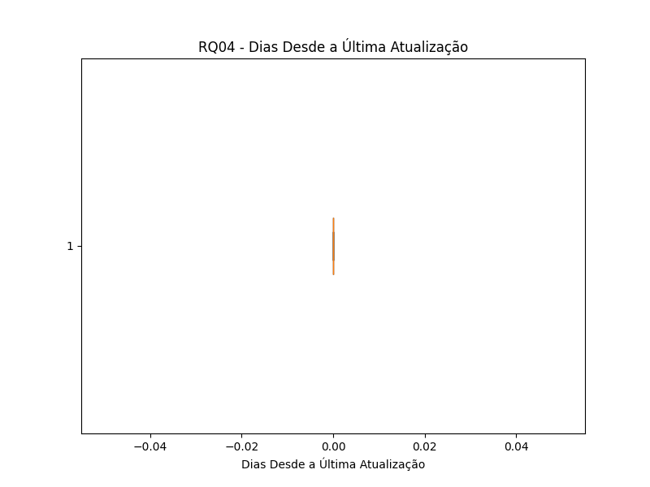
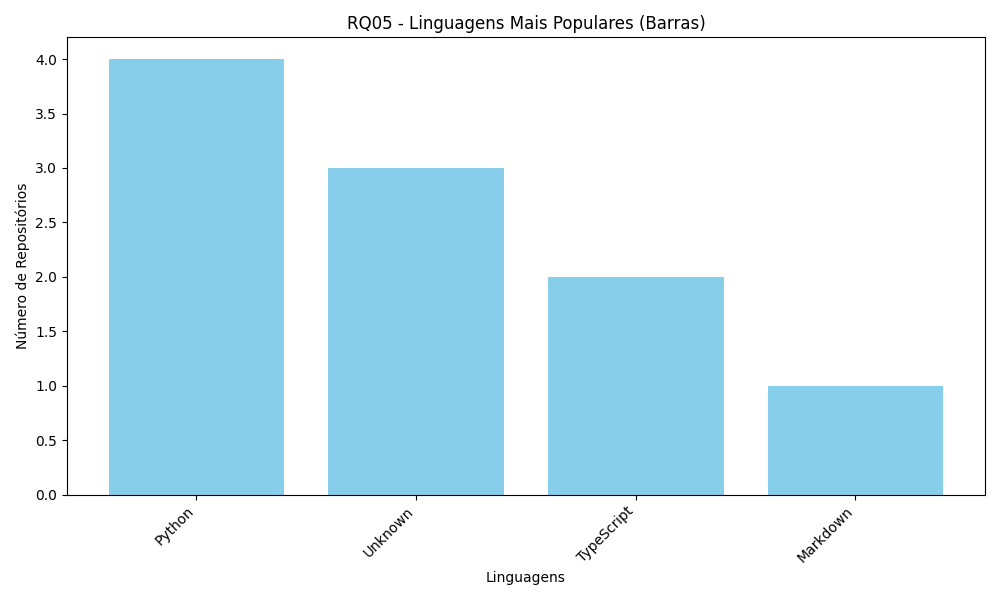
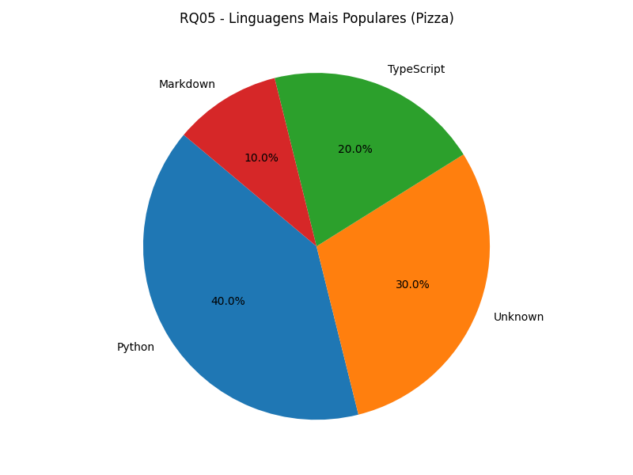
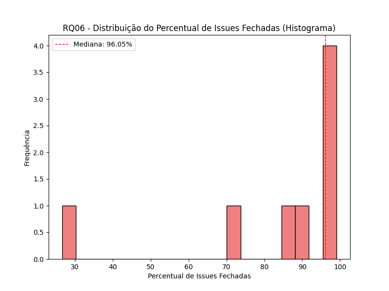
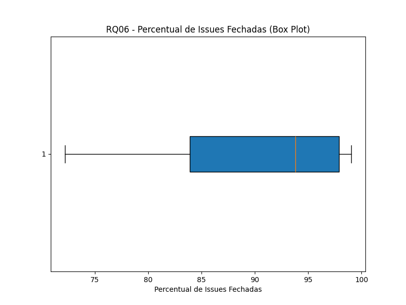

# Relatório final - Características de repositórios populares

GRUPO: Izabela Cecilia Silva Barbosa, Lucas Machado de Oliveira Andrade, Mariana Eliza Alves Costa e Vitor Fernandes de Souza

## Introdução

O cenário atual de desenvolvimento de software demanda evidências empíricas para apoiar a tomada de decisões. Neste contexto, realizamos uma investigação sistemática sobre práticas de desenvolvimento, utilizando métodos científicos para coletar e analisar dados relevantes para a comunidade de engenharia de software.

## HIPÓTESES INFORMAIS
### RQ 01. Sistemas populares são maduros/antigos?
Métrica: idade do repositório (calculado a partir da data de sua criação)
Hipótese Informal: Acredita-se que repositórios populares são, em média, mais antigos. Eles tiveram tempo para evoluir, construir uma comunidade, e acumular estrelas ao longo dos anos. Portanto, a idade mediana dos repositórios populares na amostra deve ser mais ALTA que a média. 

### RQ 02. Sistemas populares recebem muita contribuição externa?
Métrica: total de pull requests aceitas
Hipótese Informal: Repositórios populares com uma comunidade ativa e que recebem muitas pull requests aceitas (contribuições externas) possuem mais estrelas que a média. A alta visibilidade e o grande número de estrelas atraem novos contribuidores, resultando em um alto número de pull requests por repositório.

### RQ 03. Sistemas populares lançam releases com frequência?
Métrica: total de releases
Hipótese Informal: A frequência de releases é um indicativo de um ciclo de desenvolvimento ativo e de um produto em constante evolução. Repositórios populares tendem a ter um processo de entrega contínua mais robusto, com um número acima da média de releases, o que mantém os usuários engajados e os projetos atualizados.

### RQ 04. Sistemas populares são atualizados com frequência?
Métrica: tempo até a última atualização (calculado a partir da data de última atualização)
Hipótese Informal: Projetos populares são ativamente mantidos. Espera-se que o tempo desde a última atualização seja baixo da média, indicando que a base de código está em constante desenvolvimento. Repositórios com longos períodos sem atualizações, mesmo que sejam populares, podem estar em fase de hibernação ou abandonados.

### RQ 05. Sistemas populares são escritos nas linguagens mais populares?
Métrica: linguagem primária de cada um desses repositórios
Hipótese Informal: A escolha da linguagem de programação influencia diretamente a visibilidade e a popularidade. As linguagens mais populares (como JavaScript, Python, Java, etc.) têm grandes comunidades de desenvolvedores, o que facilita o aumento de estrelas e contribuições. Portanto, a maioria dos repositórios populares na amostra será escrita em uma das linguagens mais usadas no mercado.

### RQ 06. Sistemas populares possuem um alto percentual de issues fechadas?
Métrica: razão entre número de issues fechadas pelo total de issues 
Hipótese Informal: Uma taxa acima da média da amostra de issues fechadas indica que o projeto é bem gerenciado, com problemas e bugs sendo resolvidos de forma eficiente. Isso demonstra confiabilidade para a comunidade. Espera-se que a maioria dos repositórios populares tenha um percentual elevado de issues fechadas, mostrando que são reativos às demandas dos usuários.

### RQ 07: Sistemas escritos em linguagens mais populares recebem mais contribuição externa, lançam mais releases e são atualizados com mais frequência? 
Hipótese Informal: Projetos desenvolvidos em linguagens de programação mais populares (como Python, JavaScript, Java, etc.) tendem a ter uma comunidade de desenvolvedores maior. Essa base de usuários mais ampla e ativa leva a um ciclo de desenvolvimento mais dinâmico.

## Resultados

### RQ 01. Sistemas populares são maduros/antigos?

#### Métrica: idade do repositório

**Para todos os repositórios:**
  Mediana: 3056 dias
  Mín: 63 dias, Máx: 6344 dias

**Para top10 repositórios:**
  Mediana: 3443 dias
  Mín: 2343 dias, Máx: 4335 dias

### RQ 02. Sistemas populares recebem muita contribuição externa?

#### Métrica: Pull Requests Aceitas

**Para todos os repositórios:**
  Mediana: 710
  Mín: 0, Máx: 86225

**Para top10 repositórios:**
  Mediana: 1071
  Mín: 142, Máx: 25733

### RQ 03. Sistemas populares lançam releases com frequência? 

#### Métrica: Releases

**Para todos os repositórios:**
  Mediana: 36
  Mín: 0, Máx: 1000

**Para top10 repositórios:**
  Mediana: 0
  Mín: 0, Máx: 1

### RQ 04. Sistemas populares são atualizados com frequência

#### Métrica: Dias desde a última atualização

**Para todos os repositórios:**
  Mediana: 0 dias
  Mín: 0 dias, Máx: 4 dias

**Para top10 repositórios:**
  Mediana: 0 dias
  Mín: 0 dias, Máx: 0 dias

### RQ 05. Sistemas populares são escritos nas linguagens mais populares?

#### Linguagem primária de cada um desses repositórios
  Python: 189 repositórios
  TypeScript: 156 repositórios
  JavaScript: 130 repositórios
  Unknown: 103 repositórios
  Go: 73 repositórios
  Java: 50 repositórios
  C++: 48 repositórios
  Rust: 44 repositórios
  C: 25 repositórios
  Jupyter Notebook: 22 repositórios

### RQ 06. Sistemas populares possuem um alto percentual de issues fechadas? 

#### Razão entre número de issues fechadas pelo total de issues

**Para todos os repositórios:**
  Mediana: 86.57%
  Mín: 8.77%, Máx: 100.00%

**Para top10 repositórios:**
  Mediana: 96.05%
  Mín: 26.69%, Máx: 99.02%

### RQ07 - ANÁLISE POR LINGUAGEM

#### Sistemas escritos em linguagens mais populares recebem mais contribuição externa, lançam mais releases e são atualizados com mais frequência? 

Linguagens mais populares:
  - Python
  - TypeScript
  - JavaScript
  - Unknown
  - Go

Comparação: Linguagens Populares vs Outras
| Métrica                    | Populares   | Outras      |
| -------------------------- | ----------- | ----------- |
| Repositórios               |         651 |         349 |
| Mediana PRs Aceitas (RQ02) |         715 |         681 |
| Mediana Releases (RQ03)    |          42 |          31 |
| Mediana Dias Update (RQ04) |           0 |           0 |

Detalhamento por linguagem (Top 10):
| Linguagem   | Qty | Med PRs | Med Rels | Med Days Upd |
| ----------- | --- | ------- | -------- | ------------ |
| Python      | 189 |     548 |       23 |            0 |
| TypeScript  | 156 |    2143 |      147 |            0 |
| JavaScript  | 130 |     551 |       34 |            0 |
| Unknown     | 103 |     129 |        0 |            0 |
| Go          |  73 |    1690 |      124 |            0 |
| Java        |  50 |     713 |       44 |            0 |
| C++         |  48 |     934 |       60 |            0 |
| Rust        |  44 |    2174 |       87 |            0 |
| C           |  25 |     113 |       32 |            0 |
| Jupyter ... |  22 |     147 |        0 |            0 |

Conclusão
✓ Linguagens populares recebem MAIS contribuições externas
✓ Linguagens populares lançam MAIS releases
✗ Linguagens populares são atualizadas com MENOS frequência
