# Relatório final - Estudo das características de sistema Java

GRUPO: Izabela Cecilia Silva Barbosa, Lucas Machado de Oliveira Andrade, Mariana Eliza Alves Costa e Vitor Fernandes de Souza

## Introdução

O cenário atual de desenvolvimento de software demanda evidências empíricas para apoiar a tomada de decisões. Neste contexto, realizamos uma investigação sistemática sobre práticas de desenvolvimento, utilizando métodos científicos para coletar e analisar dados relevantes para a comunidade de engenharia de software.

## Questões de Pesquisa, Métricas e Hipóteses Informais

### RQ 01. Qual a relação entre a popularidade dos repositórios e as suas características de qualidade?
*   **Métrica de Popularidade:** Número de estrelas
*   **Métricas de Qualidade:** CBO (Coupling Between Objects), LCOM (Lack of Cohesion of Methods), DIT (Depth of Inheritance Tree)
*   **Hipótese Informal:** Repositórios mais populares (com maior número de estrelas) tendem a apresentar melhores características de qualidade (CBO mais baixo, DIT mais alto, LCOM mais baixo). Isso ocorre porque projetos populares atraem mais colaboradores e estão sujeitos a um escrutínio maior, incentivando a adoção de boas práticas de design e codificação.

### RQ 02. Qual a relação entre a maturidade do repositórios e as suas características de qualidade?
*   **Métrica de Maturidade:** Idade (em anos) do repositório
*   **Métricas de Qualidade:** CBO (Coupling Between Objects), LCOM (Lack of Cohesion of Methods), WMC (Weighted Methods per Class)
*   **Hipótese Informal:** Repositórios mais maduros (com maior idade) tendem a apresentar melhores características de qualidade até um certo ponto. No início, a qualidade pode aumentar com o tempo devido a refatorações e correções de bugs. No entanto, após um longo período, a qualidade pode começar a declinar devido à acumulação de dívida técnica e à dificuldade de adaptar o código a novas tecnologias.

### RQ 03. Qual a relação entre a atividade dos repositórios e as suas características de qualidade?
*   **Métrica de Atividade:** Número de releases
*   **Métricas de Qualidade:** CBO (Coupling Between Objects), LCOM (Lack of Cohesion of Methods), Número de Commits
*   **Hipótese Informal:** Repositórios com maior atividade (maior número de releases) tendem a apresentar melhores características de qualidade. A atividade constante indica que o projeto está sendo mantido ativamente, com refatorações, melhorias e correções de bugs, o que contribui para a qualidade do código.

### RQ 04. Qual a relação entre o tamanho dos repositórios e as suas características de qualidade?
*   **Métrica de Tamanho:** Linhas de código (LOC)
*   **Métricas de Qualidade:** CBO (Coupling Between Objects), LCOM (Lack of Cohesion of Methods), NOC (Number of Children)
*   **Hipótese Informal:** Repositórios maiores (com mais linhas de código) tendem a apresentar piores características de qualidade. Projetos grandes podem se tornar mais complexos e difíceis de manter, levando a um aumento no acoplamento (CBO), menor coesão (LCOM) e hierarquias de herança mais complexas (NOC). No entanto, essa relação pode ser atenuada se o projeto for bem modularizado e seguir boas práticas de design.

## Resultados

### RQ 01. Qual a relação entre a popularidade dos repositórios e as suas características de qualidade?
*   **Métrica de Popularidade:** Número de estrelas
*   **Métricas de Qualidade:** CBO (Coupling Between Objects), LCOM (Lack of Cohesion of Methods), DIT (Depth of Inheritance Tree)

- **Popularidade (stars) vs CBO:**  
  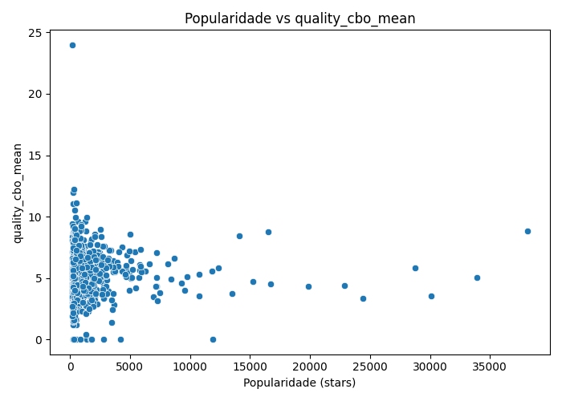
- **Popularidade (stars) vs DIT:**  
  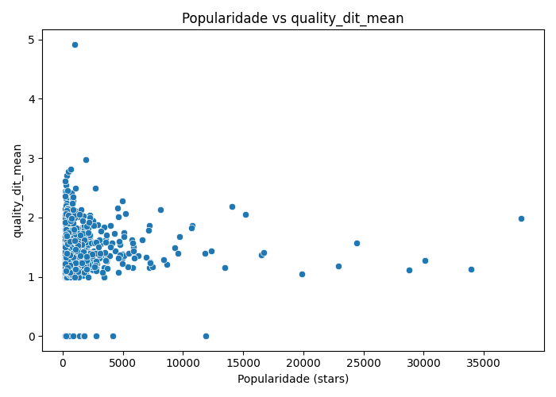
- **Popularidade (stars) vs LCOM:**  
  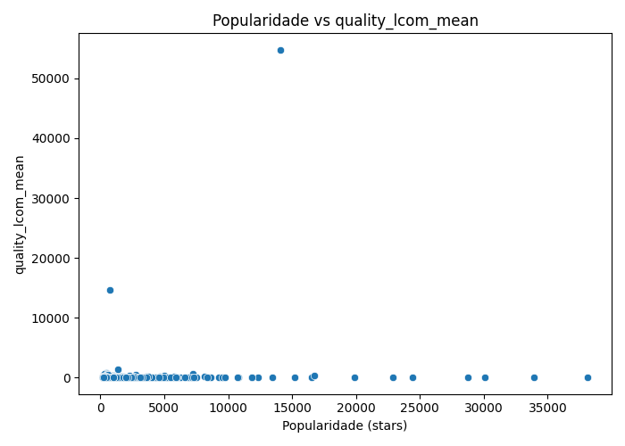

### RQ 02. Qual a relação entre a maturidade do repositórios e as suas características de qualidade?
*   **Métrica de Maturidade:** Idade (em anos) do repositório
*   **Métricas de Qualidade:** CBO (Coupling Between Objects), LCOM (Lack of Cohesion of Methods), WMC (Weighted Methods per Class)

- **Maturidade (anos) vs CBO:**  
  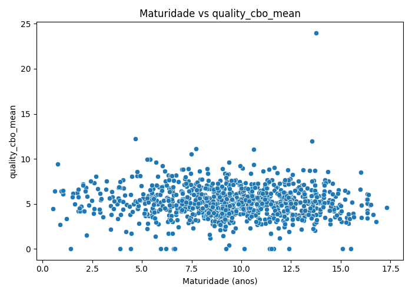
- **Maturidade (anos) vs DIT:**  
  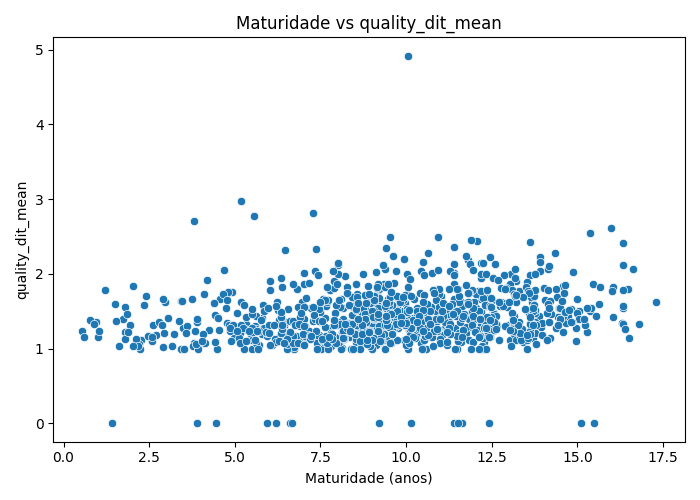
- **Maturidade (anos) vs LCOM:**  
  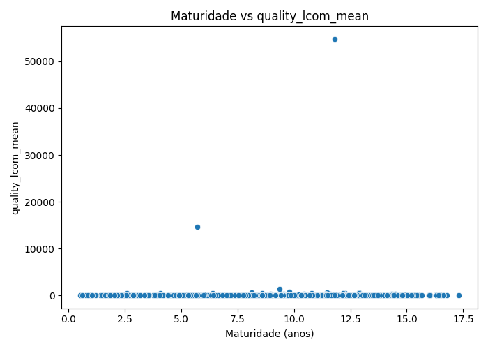

### RQ 03. Qual a relação entre a atividade dos repositórios e as suas características de qualidade?
*   **Métrica de Atividade:** Número de releases
*   **Métricas de Qualidade:** CBO (Coupling Between Objects), LCOM (Lack of Cohesion of Methods), Número de Commits

- **Atividade (releases) vs CBO:**  
  
- **Atividade (releases) vs DIT:**  
  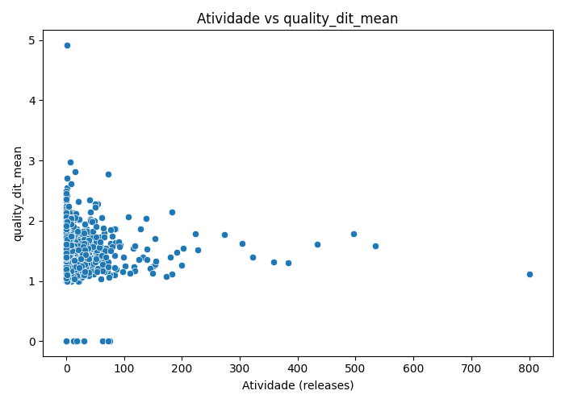
- **Atividade (releases) vs LCOM:**  
  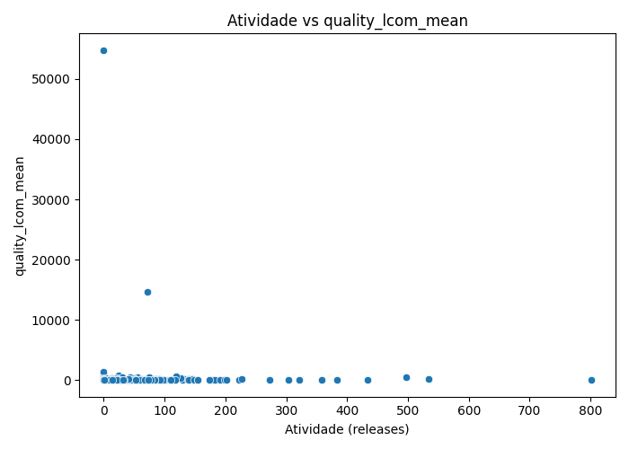

### RQ 04. Qual a relação entre o tamanho dos repositórios e as suas características de qualidade?
*   **Métrica de Tamanho:** Linhas de código (LOC)
*   **Métricas de Qualidade:** CBO (Coupling Between Objects), LCOM (Lack of Cohesion of Methods), NOC (Number of Children)

- **Tamanho (LOC) vs CBO:**  
  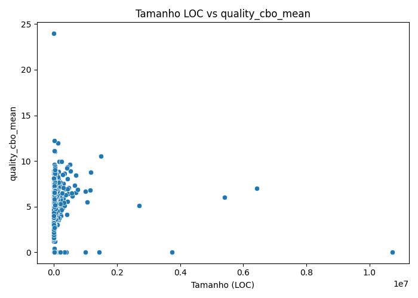
- **Tamanho (LOC) vs DIT:**  
  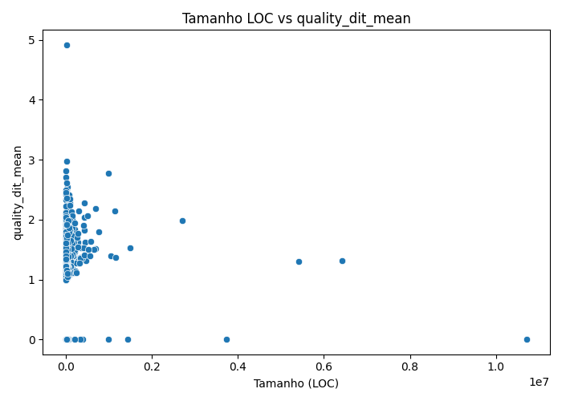
- **Tamanho (LOC) vs LCOM:**  
  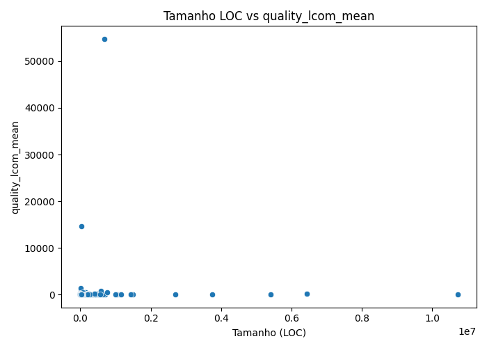
- **Tamanho (comentários) vs CBO:**  
  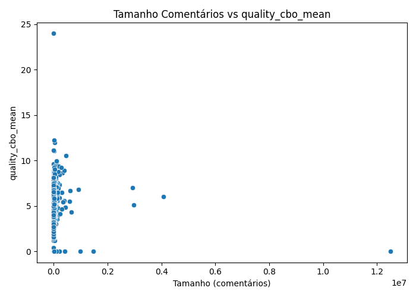
- **Tamanho (comentários) vs DIT:**  
  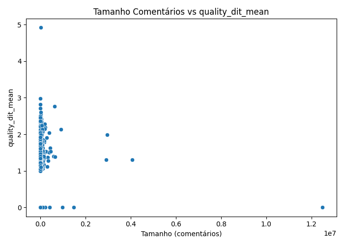
- **Tamanho (comentários) vs LCOM:**  
  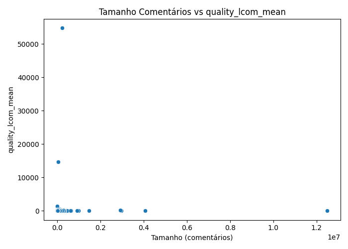
