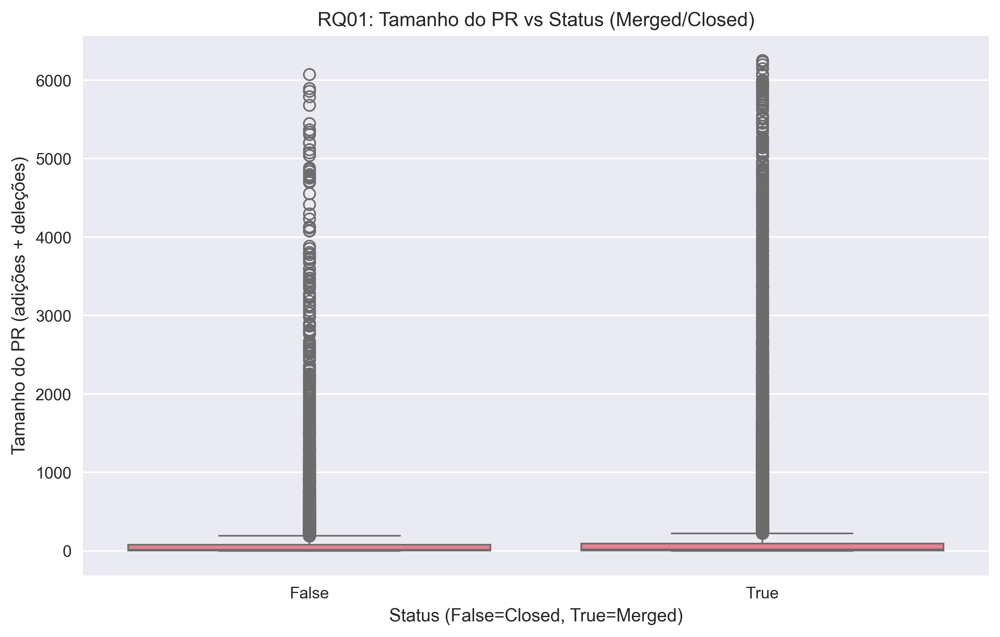
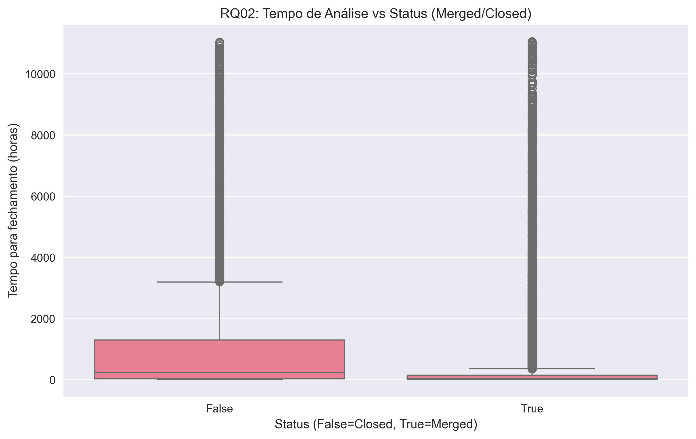
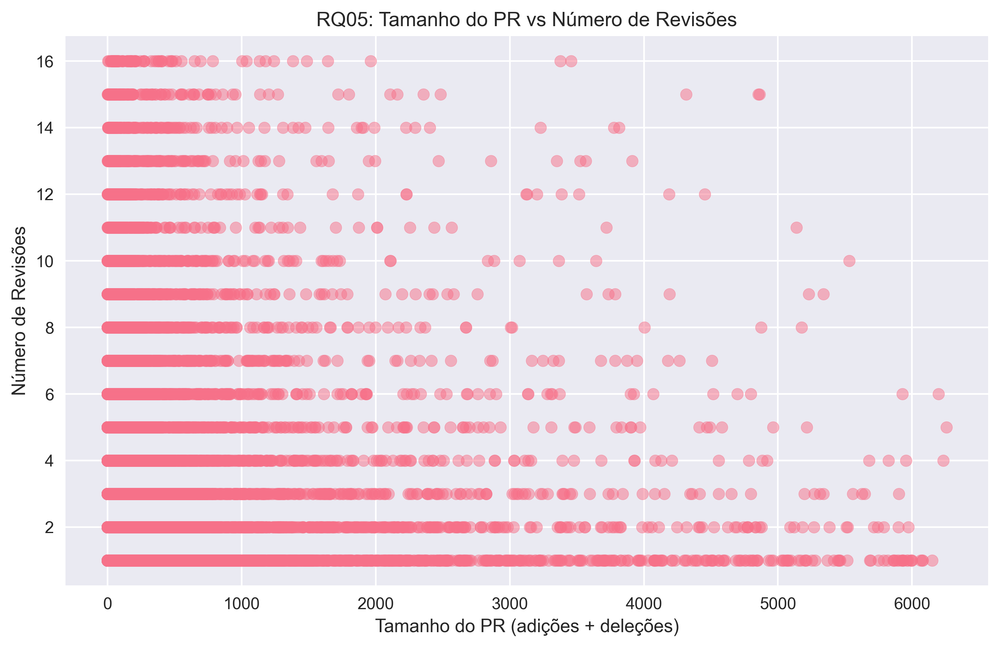

# Relatório Final - Caracterizando a Atividade de Code Review no GitHub

**Disciplina:** Laboratório de Experimentação de Software  
**Laboratório:** Lab03 - Caracterizando a atividade de code review no GitHub  
**Data:** Outubro 2025 
**Autores:** Izabela Cecilia Silva Barbosa, Lucas Machado de Oliveira Andrade, Mariana Eliza Alves Costa e Vitor Fernandes de Souza

---

## Índice
1. [Introdução](#introdução)
2. [Metodologia](#metodologia)
3. [Hipóteses Iniciais](#hipóteses-iniciais)
4. [Análise de Normalidade dos Dados](#análise-de-normalidade-dos-dados)
5. [Resultados por Research Question](#resultados-por-research-question)
6. [Discussão](#discussão)
7. [Conclusão](#conclusão)
8. [Limitações e Trabalhos Futuros](#limitações-e-trabalhos-futuros)

---

## Introdução

A prática de code review tornou-se fundamental nos processos de desenvolvimento ágil de software, especialmente em projetos open source hospedados no GitHub. Este estudo tem como objetivo analisar a atividade de code review em repositórios populares do GitHub, identificando variáveis que influenciam no merge de Pull Requests (PRs) e no número de revisões realizadas.

O estudo analisou **55,040 Pull Requests** de repositórios populares, buscando entender as relações entre tamanho dos PRs, tempo de análise, qualidade das descrições, interações entre desenvolvedores e os resultados finais do processo de revisão.

## Metodologia

### Coleta de Dados
- **Fonte:** 200 repositórios mais populares do GitHub
- **Critérios de seleção:**
  - Repositórios com pelo menos 100 PRs (MERGED + CLOSED)
  - PRs com status MERGED ou CLOSED
  - PRs com pelo menos uma revisão
  - PRs com tempo de vida > 1 hora (para excluir revisões automáticas)

### Métricas Analisadas
- **Tamanho:** Número de arquivos, total de linhas adicionadas/removidas
- **Tempo de Análise:** Intervalo entre criação e fechamento do PR
- **Descrição:** Número de caracteres no corpo do PR
- **Interações:** Número de participantes e comentários

### Análise Estatística
- **Teste de normalidade:** Shapiro-Wilk
- **Correlações:** Coeficiente de Spearman (devido à não-normalidade dos dados)
- **Significância:** p-value < 0.001 considerado altamente significativo

## Hipóteses Iniciais

### Dimensão A: Feedback Final das Revisões
- **RQ01:** PRs menores têm maior probabilidade de serem MERGED
- **RQ02:** PRs com menor tempo de análise têm maior probabilidade de MERGED
- **RQ03:** PRs com descrições mais longas/detalhadas têm maior probabilidade de MERGED
- **RQ04:** Interações mais elevadas estão associadas a menor probabilidade de MERGED

### Dimensão B: Número de Revisões
- **RQ05:** PRs maiores recebem mais revisões
- **RQ06:** PRs com maior tempo de análise recebem mais revisões
- **RQ07:** PRs com descrições mais detalhadas recebem menos revisões
- **RQ08:** PRs com mais interações recebem mais revisões

## Análise de Normalidade dos Dados

### Resultados do Teste de Shapiro-Wilk

### Tabela 1: Análise Quantitativa de Normalidade - Teste de Shapiro-Wilk

| Variável | n | Média | Mediana | Desvio Padrão | Assimetria | Curtose | p-value | Normalidade |
|----------|----|-------|---------|---------------|------------|---------|---------|-------------|
| diff_size | 55,040 | 144.72 | 18.00 | 448.97 | 6.9221 | 60.8359 | 0.000000 | ❌ Não-Normal |
| files_changed | 55,040 | 3.85 | 1.00 | 6.95 | 4.6363 | 26.6863 | 0.000000 | ❌ Não-Normal |
| time_to_close_hours | 55,040 | 409.93 | 41.56 | 1,194.32 | 5.0690 | 29.3755 | 0.000000 | ❌ Não-Normal |
| body_length_chars | 55,040 | 1,135.86 | 797.50 | 1,392.04 | 2.8475 | 11.1021 | 0.000000 | ❌ Não-Normal |
| participant_count | 55,040 | 2.84 | 3.00 | 1.25 | 1.4552 | 3.1319 | 0.000000 | ❌ Não-Normal |
| total_comments | 55,040 | 3.35 | 2.00 | 4.54 | 2.6053 | 8.6066 | 0.000000 | ❌ Não-Normal |
| review_count | 55,040 | 2.33 | 1.00 | 2.32 | 2.7579 | 8.8623 | 0.000000 | ❌ Não-Normal |

**Interpretação dos Resultados Quantitativos:**
- **Valores de Assimetria (Skewness):** Todos positivos e elevados (>1.0), indicando forte assimetria à direita
- **Valores de Curtose (Kurtosis):** Todos positivos e elevados (>3.0), indicando distribuições leptocúrticas (picos mais altos e caudas mais pesadas que a normal)
- **p-values do Shapiro-Wilk:** Todos 0.000000, rejeitando fortemente a hipótese nula de normalidade

### Tabela 2: Estatísticas Descritivas Gerais
| Variável | n | Média | Mediana | Desvio Padrão | Mínimo | Máximo |
|----------|----|-------|---------|---------------|--------|--------|
| diff_size | 55,040 | 144.72 | 18.00 | 448.97 | 0.00 | 6,255.00 |
| files_changed | 55,040 | 3.85 | 1.00 | 6.95 | 0.00 | 68.00 |
| time_to_close_hours | 55,040 | 409.93 | 41.56 | 1,194.32 | 1.00 | 11,059.95 |
| body_length_chars | 55,040 | 1,135.86 | 797.50 | 1,392.04 | 0.00 | 10,423.00 |
| participant_count | 55,040 | 2.84 | 3.00 | 1.25 | 0.00 | 9.00 |
| total_comments | 55,040 | 3.35 | 2.00 | 4.54 | 0.00 | 33.00 |
| review_count | 55,040 | 2.33 | 1.00 | 2.32 | 1.00 | 16.00 |

### Análise Visual - Q-Q Plots

**Metodologia dos Q-Q Plots:**
Os Quantile-Quantile plots comparam os quantis dos dados observados com os quantis teóricos de uma distribuição normal. Pontos alinhados na linha diagonal indicam normalidade.


**Análise dos Q-Q Plots por Variável:**

**`diff_size` (Tamanho do PR):**
- ❌ **FORTEMENTE NÃO-NORMAL**
- Pontos significativamente desviados da linha diagonal
- Padrão côncavo para cima típico de dados com assimetria positiva extrema
- Indica que a maioria dos PRs é pequena, com alguns outliers muito grandes

**`files_changed` (Arquivos Modificados):**
- ❌ **PADRÃO SIMILAR AO diff_size**
- Curva acentuada indicando muitos PRs com poucos arquivos e poucos com muitos arquivos
- Distribuição altamente concentrada em valores baixos

**`time_to_close_hours` (Tempo de Análise):**
- ❌ **NÃO-NORMAL COM CAUDAS PESADAS**
- Pontos nas extremidades desviam drasticamente da linha
- Indica que enquanto a maioria dos PRs é rápida, alguns levam tempo extremamente longo

**`body_length_chars` (Descrição):**
- ❌ **DISTRIBUIÇÃO BIMODAL POTENCIAL**
- Desvios sistemáticos em ambos os lados da distribuição
- Sugere possíveis dois grupos: PRs com descrições mínimas e PRs com descrições detalhadas

**`review_count`, `participant_count`, `total_comments`:**
- ❌ **PADRÕES DE DADOS DE CONTAGEM**
- Degraus visíveis nos plots, típicos de variáveis discretas
- Distribuições super-dispersas com excesso de zeros/valores baixos

**Conclusão da Análise de Normalidade:**
> **TODAS as variáveis analisadas apresentam distribuição não-normal com forte assimetria positiva**, justificando plenamente o uso de métodos estatísticos não paramétricos (Spearman) em todas as análises de correlação. A não-normalidade é consistente tanto nos testes quantitativos (Shapiro-Wilk) quanto na análise visual (Q-Q plots).

## Resultados por Research Question

### Tabela 3: Comparação Merged vs Closed

| Variável | Merged_Mediana | Closed_Mediana | Merged_Média | Closed_Média | Diferença_Medianas |
|----------|----------------|----------------|--------------|--------------|-------------------|
| diff_size | 19.00 | 14.00 | 145.47 | 140.70 | +5.00 |
| files_changed | 2.00 | 1.00 | 4.01 | 3.04 | +1.00 |
| time_to_close_hours | 31.87 | 224.35 | 255.21 | 1,235.86 | -192.48 |
| body_length_chars | 752.00 | 936.00 | 1,103.43 | 1,308.98 | -184.00 |
| participant_count | 3.00 | 3.00 | 2.81 | 3.03 | 0.00 |
| total_comments | 1.00 | 3.00 | 3.11 | 4.63 | -2.00 |
| review_count | 1.00 | 1.00 | 2.36 | 2.20 | 0.00 |

### Tabela 4: Resultados das Correlações por Research Question

| Research Question | Correlação | p-value | Método | Significância |
|-------------------|------------|---------|--------|---------------|
| RQ01 | 0.0566 | 0.000000 | spearman | *** |
| RQ02 | -0.2395 | 0.000000 | spearman | *** |
| RQ03 | -0.0682 | 0.000000 | spearman | *** |
| RQ04_participant_count | -0.0613 | 0.000000 | spearman | *** |
| RQ04_total_comments | -0.1828 | 0.000000 | spearman | *** |
| RQ04_review_count | 0.0386 | 0.000000 | spearman | *** |
| RQ05 | 0.2259 | 0.000000 | spearman | *** |
| RQ06 | 0.2075 | 0.000000 | spearman | *** |
| RQ07 | 0.1697 | 0.000000 | spearman | *** |
| RQ08_participant_count | 0.4299 | 0.000000 | spearman | *** |
| RQ08_total_comments | 0.4906 | 0.000000 | spearman | *** |

### 📊 Dimensão A: Feedback Final das Revisões

#### RQ01: Tamanho dos PRs vs Feedback Final

``` text
Correlação de Spearman: +0.0566 (p < 0.001)
Mediana - Merged: 19 linhas | Closed: 14 linhas
Diferença: +5 linhas (PRs merged são maiores)
```

#### Análise Visual:



**Interpretação:** Correlação positiva fraca porém significativa. Contrariando a hipótese inicial, PRs MERGED são ligeiramente MAIORES que PRs CLOSED.

#### RQ02: Tempo de Análise vs Feedback Final

``` text
Correlação de Spearman: -0.2395 (p < 0.001)
Mediana - Merged: 32 horas | Closed: 224 horas
Diferença: -192 horas (PRs merged são 7x mais rápidos)
```

#### Análise Visual:



**Interpretação:** Correlação negativa forte. PRs MERGED são **7x mais rápidos** que PRs CLOSED, confirmando a hipótese inicial.

#### RQ03: Descrição dos PRs vs Feedback Final

``` text
Correlação de Spearman: -0.0682 (p < 0.001)
Mediana - Merged: 752 caracteres | Closed: 936 caracteres
Diferença: -184 caracteres (PRs merged têm descrições 24% mais curtas)
```

**Interpretação:** Correlação negativa fraca. PRs MERGED têm descrições **24% mais curtas**, refutando a hipótese inicial.

#### RQ04: Interações vs Feedback Final

``` text
Participantes: -0.0613
Comentários: -0.1828
Revisões: +0.0386
```

**Interpretação:** Menos participantes e comentários correlacionam com maior chance de MERGE, confirmando a hipótese.

### 📈 Dimensão B: Número de Revisões

#### RQ05: Tamanho vs Número de Revisões

``` text
Correlação de Spearman: +0.2259 (p < 0.001)
```

#### Análise Visual:



**Interpretação:** Correlação positiva moderada. PRs maiores recebem mais revisões, confirmando a hipótese.

#### RQ06: Tempo vs Número de Revisões

``` text
Correlação de Spearman: +0.2075 (p < 0.001)
```

**Interpretação:** Correlação positiva moderada. Mais revisões levam a tempos maiores, confirmando a hipótese.

#### RQ07: Descrição vs Número de Revisões

``` text
Correlação de Spearman: +0.1697 (p < 0.001)
```

**Interpretação:** Correlação positiva fraca. PRs com descrições maiores recebem MAIS revisões, refutando a hipótese.

#### RQ08: Interações vs Número de Revisões

``` text
Participantes: +0.4299
Comentários: +0.4906
```

**Interpretação:** Correlações fortes positivas. Mais interações levam a muito mais revisões, confirmando a hipótese.

## Discussão

### Impacto da Não-Normalidade nas Análises
A forte não-normalidade identificada tanto pelos testes de Shapiro-Wilk (Tabela 1) quanto pela análise visual dos Q-Q plots tem implicações importantes:

1. **Validade Estatística:** Justifica completamente o uso de correlações de Spearman
2. **Interpretação de Médias:** As médias são fortemente influenciadas por outliers (ex: média de tempo = 410h vs mediana = 42h)
3. **Robustez das Conclusões:** As medianas (Tabela 2) são medidas mais confiáveis que as médias para descrever os dados
4. **Natureza dos Dados:** Reflete a realidade do desenvolvimento - muitos PRs pequenos/rápidos, poucos muito grandes/lentos

### Padrões Identificados

#### ✅ Hipóteses Confirmadas:
1. **Velocidade é crucial:** PRs mais rápidos têm 7x mais chance de merge (RQ02)
2. **Tamanho importa para revisões:** PRs maiores demandam mais revisões (RQ05)
3. **Interações aumentam esforço:** Mais participantes/comentários → muito mais revisões (RQ08)
4. **Processos ágeis favorecem merge:** Menos interações correlacionam com aceitação (RQ04)

#### ❌ Hipóteses Refutadas:
1. **Tamanho não determina aceitação:** PRs merged são ligeiramente maiores (RQ01)
2. **Descrições longas não ajudam:** PRs merged têm descrições mais curtas (RQ03)
3. **Clareza não reduz revisões:** Descrições maiores → mais revisões (RQ07)

### Insights Práticos

**Para Desenvolvedores:**
- Foque em PRs pequenos e **rápidos** mais que em PRs pequenos apenas
- Descrições concisas podem ser mais eficientes que descrições muito longas
- Evite discussões extensas nos PRs - resolva conflitos rapidamente

**Para Revisores:**
- PRs maiores precisam de mais atenção e tempo de revisão
- Muitos comentários podem indicar problemas fundamentais no PR
- Velocidade de revisão é fator crítico para aceitação

**Para Gestores:**
- Otimizar processo para decisões rápidas
- Estabelecer limites de tamanho para PRs
- Promover cultura de revisões ágeis e focadas

### Comparação Merged vs Closed

| Variável | Merged | Closed | Diferença |
|----------|--------|--------|-----------|
| **Tempo** | 32h | 224h | 🚀 Merged 7x mais rápido |
| **Descrição** | 752 chars | 936 chars | 📝 Closed +24% mais longas |
| **Comentários** | 1 | 3 | 💬 Closed 3x mais comentários |
| **Arquivos** | 2 | 1 | 📁 Merged modificam +1 arquivo |

## Conclusão

Este estudo revelou que a **velocidade do processo de review** (RQ02: -0.240) é o fator mais determinante para a aceitação de Pull Requests, superando em importância o tamanho do código ou a extensão das descrições. PRs merged são significativamente mais rápidos (7x) que PRs closed, demonstrando a importância de processos ágeis e decisões rápidas no code review.

As interações entre desenvolvedores mostraram-se como uma faca de dois gumes: enquanto muitas interações correlacionam com mais revisões (RQ08: +0.430 a +0.491) e menor chance de aceitação (RQ04: -0.183), elas são necessárias para PRs complexos. O desafio está em balancear discussões produtivas com agilidade no processo.

Contrariando expectativas iniciais, PRs com descrições mais curtas (RQ03: -0.068) e menos interações tiveram maior taxa de sucesso, sugerindo que simplicidade e foco podem ser mais valorizados que detalhamento excessivo em muitos contextos de code review.

**Validação Metodológica:** A consistência entre os resultados do teste de Shapiro-Wilk (Tabela 1) e a análise visual dos Q-Q plots reforça a robustez da escolha por métodos não paramétricos, assegurando a validade estatística das correlações reportadas na Tabela 4.

## Limitações e Trabalhos Futuros

### Limitações:
- **Dados Altamente Assimétricos:** Como evidenciado pela Tabela 1 e Q-Q plots, as distribuições são fortemente não-normais
- **Análise Correlacional:** As relações identificadas são associativas, não causais
- **Influência de Outliers:** A presença de valores extremos pode influenciar algumas correlações
- **Fatores Qualitativos:** Não foram considerados aspectos como qualidade do código ou experiência dos desenvolvedores

### Trabalhos Futuros:
- Análise de sentimentos nos comentários de review
- Estudo de fatores qualitativos na aceitação de PRs
- Análise temporal da evolução dos padrões de review
- Investigação de diferenças entre linguagens de programação
- Desenvolvimento de modelos preditivos para aceitação de PRs
- Estudo do impacto da experiência dos desenvolvedores no processo
- Análise de padrões específicos por domínio de aplicação

---

**Anexos Disponíveis:**
- normality_analysis.csv
- descriptive_statistics.csv  
- merged_vs_closed_comparison.csv
- correlation_results.csv
- Gráficos de análise (pasta plots/)
